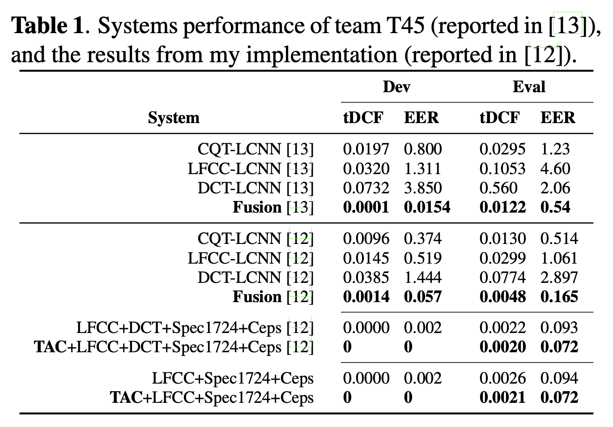

## Introduction

#### This repository provides the implemetation of the replayed speech detection system used in the papers:

Shih-Kuang Lee, Yu Tsao, and Hsin-Min Wang, “[A Study of Using Cepstrogram for Countermeasure Against Replay Attacks](https://arxiv.org/abs/2204.04333),” arXiv preprint arXiv:2204.04333, 2022.

Shih-Kuang Lee, Yu Tsao, and Hsin-Min Wang, “[Detecting Replay Attacks Using Single-Channel Audio: The Temporal Autocorrelation of Speech](http://www.apsipa.org/proceedings/2022/APSIPA%202022/ThPM2-4/1570818355.pdf),” in 2022 Asia Pacific Signal and Information Processing Association Annual Summit and Conference (APSIPA ASC) (APSIPA ASC 2022), Chiang Mai, Thailand, Nov. 2022.

Shih-Kuang Lee, “[Arbitrary Discrete Fourier Analysis and Its Application in Replayed Speech Detection](https://arxiv.org/abs/2403.01130),” arXiv preprint arXiv:2403.01130, 2024.

## Results

All systems reported in the papers are trained, validated and evaluated on [ASVspoof 2019 physical access (PA)](https://www.asvspoof.org/index2019.html) database, scores can be found in the directory [CMs](./CMs).

#### Results of the baseline system, it is the implementation of the system used in:

Lavrentyeva, G., Novoselov, S., Tseren, A., Volkova, M., Gorlanov, A., Kozlov, A. (2019) [STC Antispoofing Systems for the ASVspoof2019 Challenge](https://www.isca-speech.org/archive/interspeech_2019/lavrentyeva19_interspeech.html). Proc. Interspeech 2019, 1033-1037, doi: 10.21437/Interspeech.2019-1768


#### Results of the single systems:


#### Results of the fusion systems fused with equal weight (sum of scores):




## Clone repository
```
git clone --recursive https://github.com/shihkuanglee/RD-LCNN.git
```

## Dependencies
```
pip install -r requirements.txt
pip install -r TAC/requirements.txt
pip install -r ADFA/requirements.txt
```

## Prepare data
```
sh prepare_PA.sh
```

## Prepare feature
```
python prepare_TAC.py --path_data ../ --year 2019 --task PA --dataset  all --feature  TAC
python prepare_TAC.py --path_data ../ --year 2019 --task PA --dataset  dev --feature MTAC
python prepare_TAC.py --path_data ../ --year 2021 --task PA --dataset eval --feature QTAC
```

## Training, validation and evaluation
```
# with cuda
python main.py --cuda_vd 0 --path_data ../ASVspoof2019 --conifg_section  CQT --WRSns 9000
python main.py --cuda_vd 0 --path_data ../ASVspoof2019 --conifg_section LFCC --WRSns 1000
python main.py --cuda_vd 0 --path_data ../ASVspoof2019 --conifg_section  DCT --WRSns 9000
python main.py --cuda_vd 0 --path_data ../ASVspoof2019 --conifg_section Spec
python main.py --cuda_vd 0 --path_data ../ASVspoof2019 --conifg_section     Spec1724 --WRSns 9000
python main.py --cuda_vd 0 --path_data ../ASVspoof2019 --conifg_section Log-Spec1724 --WRSns 9000
python main.py --cuda_vd 0 --path_data ../ASVspoof2019 --conifg_section Ceps
python main.py --cuda_vd 0 --path_data ../ASVspoof2019 --conifg_section Ceps1724 --WRSns 9000
python main.py --cuda_vd 0 --path_data ../ASVspoof2019 --conifg_section TAC --dmode_train fixed --dmode___dev fixed --dmode__eval fixed --WRSns 1000
python main.py --cuda_vd 0 --path_data ../ASVspoof2019 --conifg_section ADFA --WRSns 9000
python main.py --cuda_vd 0 --path_data ../ASVspoof2019 --conifg_section MDFA --WRSns 9000
python main.py --cuda_vd 0 --path_data ../ASVspoof2019 --conifg_section CQFA --WRSns 9000
python main.py --cuda_vd 0 --path_data ../ASVspoof2019 --conifg_section ATAC --dmode_train fixed --dmode___dev fixed --dmode__eval fixed --WRSns 1000
python main.py --cuda_vd 0 --path_data ../ASVspoof2019 --conifg_section MTAC --dmode_train fixed --dmode___dev fixed --dmode__eval fixed --WRSns 1000
python main.py --cuda_vd 0 --path_data ../ASVspoof2019 --conifg_section QTAC --dmode_train fixed --dmode___dev fixed --dmode__eval fixed --WRSns 1000

# with cpu
python main.py --device cpu --path_data ../ASVspoof2019 --conifg_section TAC --dmode_train fixed --dmode___dev fixed --dmode__eval fixed --WRSns 1000
```

## Citation Information

Shih-Kuang Lee, Yu Tsao, and Hsin-Min Wang, “A Study of Using Cepstrogram for Countermeasure Against Replay Attacks,” arXiv preprint arXiv:2204.04333, 2022.
```bibtex
@article{lee2022study,
  title={{A Study of Using Cepstrogram for Countermeasure Against Replay Attacks}},
  author={Shih-Kuang Lee and Yu Tsao and Hsin-Min Wang},
  journal={arXiv preprint arXiv:2204.04333},
  year={2022}}
```

Shih-Kuang Lee, Yu Tsao, and Hsin-Min Wang, “Detecting Replay Attacks Using Single-Channel Audio: The Temporal Autocorrelation of Speech,” in 2022 Asia Pacific Signal and Information Processing Association Annual Summit and Conference (APSIPA ASC) (APSIPA ASC 2022), Chiang Mai, Thailand, Nov. 2022.
```bibtex
@INPROCEEDINGS{Lee2211:Detecting,
  AUTHOR={Shih-Kuang Lee and Yu Tsao and Hsin-Min Wang},
  TITLE={{Detecting Replay Attacks Using Single-Channel Audio: The Temporal Autocorrelation of Speech}},
  BOOKTITLE={2022 Asia Pacific Signal and Information Processing Association Annual Summit and Conference (APSIPA ASC) (APSIPA ASC 2022)},
  ADDRESS={Chiang Mai, Thailand},
  MONTH={nov},
  YEAR={2022}}
```

Shih-Kuang Lee, “Arbitrary Discrete Fourier Analysis and Its Application in Replayed Speech Detection,” arXiv preprint arXiv:2403.01130, 2024.
```bibtex
@article{lee2024arbitrary,
  title={{Arbitrary Discrete Fourier Analysis and Its Application in Replayed Speech Detection}},
  author={Shih-Kuang Lee},
  journal={arXiv preprint arXiv:2403.01130},
  year={2024}}
```

## Licensing

This repository is licensed under the [ISC License](https://github.com/shihkuanglee/RD-LCNN/blob/main/LICENSE.md).

This repository includes modified codes from [Librosa](https://github.com/librosa/librosa), also ISC licensed.
